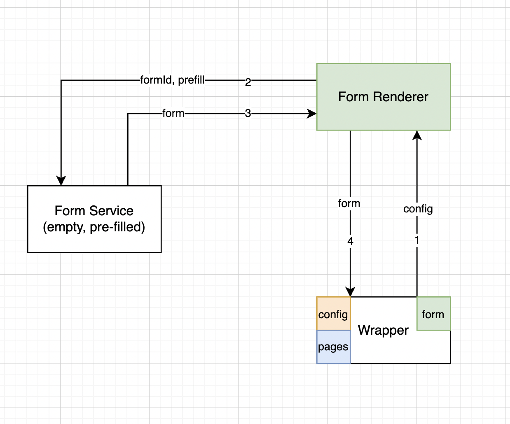

<p align="center">
  <h1>Workflow Module</h1>
</p>

[](https://gitpod.io/#https://github.com/Samagra-Development/workflow/tree/dev)

## About :open_book:

Enketo has been used all around the world for a wide range of purposes, from needs assessments in humanitarian aid, to raising historical awareness, to clinical research, to election monitoring.

## Features :dart:

- [x] Can connect to your custom backend
- [ ] Have the edit api in case user wants to edit submitted response
- [ ] Api to customize changes in XML of the form
- [x] Have beautiful themes and widgets
- [x] Are printer-friendly
- [x] Can use very powerful skip and validation logic
- [x] Runs on any device, mobile or desktop, as long as it has a fairly modern browser

## Use Case :rocket:


## Requirements :scroll:

1. Your machine should have [Yarn](https://classic.yarnpkg.com/en/docs/install/#windows-stable) or [Npm](https://docs.npmjs.com/downloading-and-installing-node-js-and-npm), [Docker](https://docs.docker.com/get-docker/), [Python](https://www.python.org/downloads/) installed.

*Note: Preferable Npm version (6.14.15) and Node version(v14.18.1) and Ubuntu OS version(18.04)**

2. Check the node and npm version by running following commands.

```sh
node -v
npm -v
```

# How to get up and running?

- Fork this repo 🍴
- Click on the Gitpod button above ☝️
- It opens a complete development setup directly 😄
- No need to clone and struggle with installing packages, managing node versions, banging head on the keyboard, etc (Cool right?)

### This is how it looks 👀


# How to interact?
- If you go to ports on terminal and open the `React Wrapper app` running on port 3000 you can see a demo UI like this 👇


- Currently offering 4 demo flows namely
- Jumping Forms (Opening of next form once the first one is submitted)
- Hasura Submissions (Basically saving the form data to any database, hasura extending postgres in this case)
- Offline capabilites (How the form behaves when working offline)
- File Upload (How to handle uploading files to any desired CDN, Minio in this case)

# Flows Explained 📝
## Jumping Forms
- This flow basically covers how you can configure your forms using form spec file (covered in a little while) to handle how the submission works. Like opening another form or redirecting to some page within the app or opening this link [here](https://www.youtube.com/watch?v=dQw4w9WgXcQ)


## Hasura Submissions
- Covering how to handle form data submission to your database be it a sql or NoSql based db. In our setup we have used Hasura which creates an instant GraphQL data provider to use with Postgres based db


## Offline Capabilites
- Just touching on to the offline capabilites offered right now. Here we have configured the form such that rather than failing form submissions entirely, it throws a warning/info message to the user indicating that the user is offline and is advised to resubmit the form once they're back online.


## File Upload
- One of the most important thing in any kind of form input is how to handle file uploads. Workflow module allows you to configure your cdn easily and point file uploads directly to the CDN effortleslly 💃 In our configuration we have used Minio to store all the uploaded files.


# How to integrate custom backend?

In order to achiever this, the submission url in the form spec (covered later below) with your hosted backend.


# Future Enhancements :rocket:

- [Encrypting query parameters on rendering the enketo form. ](https://github.com/Samagra-Development/enketo/issues/1)
- Writing a API for changing an XML form directly from it.
- add npm scripts for install

We are trying to an inversion of control here.

# API Docs 🤓

### For Get API

`curl --location --request GET 'http://localhost:3002/form/form2'`

### Form PrefillXML API

```sh
curl 'https://3006-samagradevelop-workflow-mxpsr1yqse0.ws-us92.gitpod.io/prefillXML?form=jumping_form_1&onFormSuccessData=formFunction' \
  -H 'authority: 3006-samagradevelop-workflow-mxpsr1yqse0.ws-us92.gitpod.io' \
  -H 'accept: */*' \
  -H 'accept-language: en-GB,en-US;q=0.9,en;q=0.8' \
  -H 'content-type: text/plain;charset=UTF-8' \
  -H 'origin: https://3000-samagradevelop-workflow-mxpsr1yqse0.ws-us92.gitpod.io' \
  -H 'referer: https://3000-samagradevelop-workflow-mxpsr1yqse0.ws-us92.gitpod.io/' \
  -H 'sec-ch-ua: "Google Chrome";v="111", "Not(A:Brand";v="8", "Chromium";v="111"' \
  -H 'sec-ch-ua-mobile: ?0' \
  -H 'sec-ch-ua-platform: "macOS"' \
  -H 'sec-fetch-dest: empty' \
  -H 'sec-fetch-mode: cors' \
  -H 'sec-fetch-site: same-site' \
  -H 'user-agent: Mozilla/5.0 (Macintosh; Intel Mac OS X 10_15_7) AppleWebKit/537.36 (KHTML, like Gecko) Chrome/111.0.0.0 Safari/537.36' \
  --data-raw '{}' \
  --compressed
```

## Architecture

<!-- Insert LLD Image here -->



## Wrapper Config

Example config
```json
{
  "start": "form1",
  "forms": {
    "form1": {
      "skipOnSuccessMessage": true,
      "prefill": {},
      "submissionURL": "http://esamwad.samagra.io/api/v4/form/submit",
      "name": "SampleForm",
      "successCheck": "async (formData) => { console.log('From isSuccess', formData.getElementsByTagName('reg_no')[0].textContent); return formData.getElementsByTagName('reg_no')[0].textContent === 'registration123'; }",
      "onSuccess": {
        "notificationMessage": "Form submitted successfully or not Maybe",
        "sideEffect": "async (formData) => { return JSON.parse(decodeURIComponent('%7B%0A%20%20%20%20%20%20%20%20%22name%22%3A%20%22DEVA%22%2C%0A%20%20%20%20%20%20%20%20%22batch%22%3A%20%222021-2023%22%2C%0A%20%20%20%20%20%20%20%20%22id%22%3A%208%2C%0A%20%20%20%20%20%20%20%20%22DOB%22%3A%20%222005-03-04%22%2C%0A%20%20%20%20%20%20%20%20%22affiliationType%22%3A%20%22NCVT%22%2C%0A%20%20%20%20%20%20%20%20%22registrationNumber%22%3A%20%22ICA211021569832%22%2C%0A%20%20%20%20%20%20%20%20%22tradeName%22%3A%20%22Electrician%22%2C%0A%20%20%20%20%20%20%20%20%22iti%22%3A%207%2C%0A%20%20%20%20%20%20%20%20%22industry%22%3A%201%2C%0A%20%20%20%20%20%20%20%20%22itiByIti%22%3A%20%7B%0A%20%20%20%20%20%20%20%20%20%20%20%20%22id%22%3A%207%2C%0A%20%20%20%20%20%20%20%20%20%20%20%20%22name%22%3A%20%22GITI%20Nagina%22%0A%20%20%20%20%20%20%20%20%7D%2C%0A%20%20%20%20%20%20%20%20%22industryByIndustry%22%3A%20%7B%0A%20%20%20%20%20%20%20%20%20%20%20%20%22id%22%3A%201%2C%0A%20%20%20%20%20%20%20%20%20%20%20%20%22name%22%3A%20%22Kaushal%20Bhawan%22%2C%0A%20%20%20%20%20%20%20%20%20%20%20%20%22latitude%22%3A%2030.695753%2C%0A%20%20%20%20%20%20%20%20%20%20%20%20%22longitude%22%3A%2076.872025%2C%0A%20%20%20%20%20%20%20%20%20%20%20%20%22schedules%22%3A%20%5B%0A%20%20%20%20%20%20%20%20%20%20%20%20%20%20%20%20%7B%0A%20%20%20%20%20%20%20%20%20%20%20%20%20%20%20%20%20%20%20%20%22is_industry%22%3A%20true%0A%20%20%20%20%20%20%20%20%20%20%20%20%20%20%20%20%7D%0A%20%20%20%20%20%20%20%20%20%20%20%20%5D%0A%20%20%20%20%20%20%20%20%7D%0A%20%20%20%20%7D')); }",
        "next": {
          "type": "form",
          "id": "form2"
        }
      },
      "onFailure": {
        "message": "Form submission failed",
        "sideEffect": "async (formData) => { console.log(formData); }",
        "next": {
          "type": "url",
          "id": "google"
        }
      },
      "metaData": {
        "constant1": "Test"
      }
    },
    "form2": {
      "skipOnSuccessMessage": true,
      "prefill": {
        "pf_name": "`${onFormSuccessData.name}`",
        "pf_iti": "`${onFormSuccessData.itiByIti.name}`",
        "pf_trade": "`${onFormSuccessData.tradeName}`",
        "pf_batch": "`${onFormSuccessData.batch}`",
        "pf_industry": "`${onFormSuccessData.industryByIndustry.name}`"
      },
      "submissionURL": "http://esamwad.samagra.io/api/v4/form/submit",
      "name": "SampleForm",
      "successCheck": "async (formData) => { console.log('From isSuccess', formData.getElementsByTagName('reg_no')[0].textContent); return formData.getElementsByTagName('reg_no')[0].textContent === 'registration123'; }",
      "onSuccess": {
        "message": "Form submitted successfully",
        "sideEffect": "async (formData) => { console.log(formData); }",
        "next": {
          "type": "form",
          "id": "form2"
        }
      },
      "onFailure": {
        "notificationMessage": "Form submission failed",
        "sideEffect": "async (formData) => { console.log(formData); }",
        "next": {
          "type": "url",
          "id": "https://google.com"
        }
      },
       "metaData": {
        "constantForm2": "Test"
      }
    }
  },
  "urls": {
    "google": {
      "url": "https://google.com",
      "queryParams": {},
      "onSuccess": {
        "message": null,
        "sideEffect": "async (formData) => { console.log(formData); }",
        "next": null
      }
    }
  },
  "metaData": {}
}
```

### State
State for prefilling, sideEffect.
```json
{
    "onFormSuccessData": {},
    "formConfig": {},
    "formState": {},
}
```

TODO: Add details on the specifications

## Possible Attack Vectors
1. XSS (High Priority) - Simple form
2. SQL Injection (High Priority) - needs to be fixed.

NOTE:
-----
```
For local development enketo-express needs node 14 and pnpm@7
Run nvm use 14 && npm i -g pnpm@7 if developing in enketo-express
```
